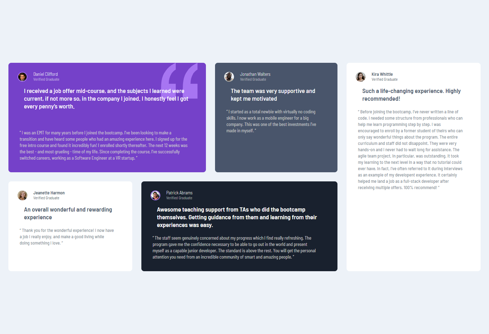

# Frontend Mentor - Testimonials grid section solution

This is a solution to the [Testimonials grid section challenge on Frontend Mentor](https://www.frontendmentor.io/challenges/testimonials-grid-section-Nnw6J7Un7). Frontend Mentor challenges help you improve your coding skills by building realistic projects. 

## Table of contents

- [Overview](#overview)
  - [The challenge](#the-challenge)
  - [Screenshot](#screenshot)
  - [Links](#links)
- [My process](#my-process)
  - [Built with](#built-with)
  - [What I learned](#what-i-learned)
  - [Continued development](#continued-development)
  - [Useful resources](#useful-resources)
- [Author](#author)

## Overview

### The challenge

Users should be able to:

- View the optimal layout for the site depending on their device's screen size

### Screenshot

### Links

- Solution URL: https://github.com/gianmromero/testimonials-grid-section-main
- Live Site URL: [Add live site URL here](https://your-live-site-url.com)

## My process

### Built with

- Semantic HTML5 markup
- CSS custom properties
- CSS Grid layout
- Mobile-first workflow
- BEM Methodolody

### What I learned

I use BEM methodology for the first time and keep learning about grid layout.

### Continued development

I will using BEM methodology in my projects and learning about how using grid layout.

### Useful resources

- https://cssguidelin.es/#bem-like-naming - This is a good resource to follow the BEM methodology.
- https://www.joshwcomeau.com/css/interactive-guide-to-grid/ - An interactive way to understand better grid properties.

## Author

- Frontend Mentor - [@gianmromero](https://www.frontendmentor.io/profile/gianmromero)
